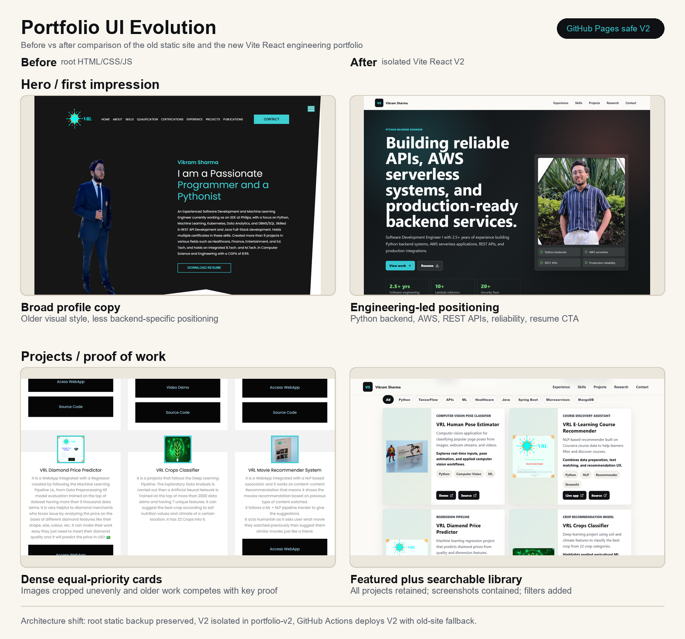
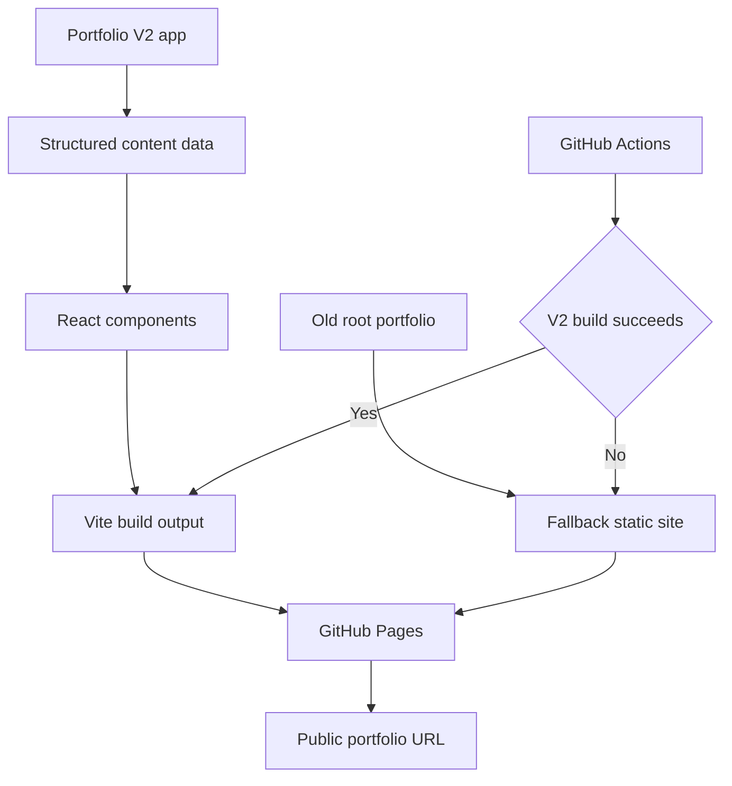
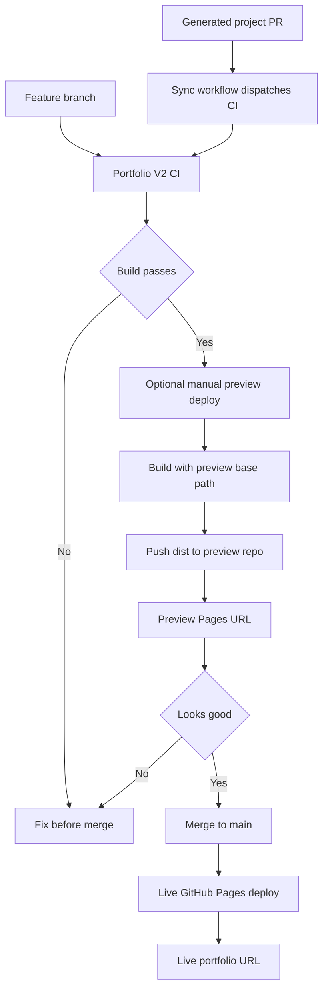

# My Portfolio

Modern portfolio for Vikram Sharma, focused on Python backend engineering, AWS serverless systems, REST APIs, production reliability, and selected project work.

Live site: [vikramsh2002.github.io/My-Portfolio](https://vikramsh2002.github.io/My-Portfolio/)

Preview site, when deployed manually: [vikramsh2002.github.io/My-Portfolio-Preview](https://vikramsh2002.github.io/My-Portfolio-Preview/)

## Portfolio V2

The modern version is isolated under [`portfolio-v2`](portfolio-v2/) and built with Vite + React. The original root HTML/CSS/JS portfolio is preserved as a fallback so the site can recover automatically if the V2 build fails.



## Architecture

Detailed architecture notes: [portfolio-v2/docs/architecture.md](portfolio-v2/docs/architecture.md)

GitHub Models project sync workflow: [portfolio-v2/docs/portfolio-sync.md](portfolio-v2/docs/portfolio-sync.md)



## Workflows

This repository uses three safety layers:

- `Portfolio V2 CI`: builds `portfolio-v2` on pull requests without deploying.
- `Deploy Portfolio Preview`: manually builds a branch and publishes only the static `dist/` output to a separate preview repository.
- `Deploy Portfolio V2 to GitHub Pages`: deploys the live site only from `main`.

Generated portfolio sync PRs are created by `github-actions[bot]`. Because GitHub does not fire normal `pull_request` workflows from `GITHUB_TOKEN`-created events, the sync workflow explicitly dispatches `Portfolio V2 CI` for the generated branch after it opens the PR.



## Preview Strategy

Preview deploys use a separate repository as a static hosting target:

```text
Source repo:  vikramsh2002/My-Portfolio
Preview repo: vikramsh2002/My-Portfolio-Preview
```

The source code stays in `My-Portfolio`. The preview workflow builds the selected branch, then pushes only `portfolio-v2/dist` into the preview repository's Pages branch.

This keeps the preview URL separate from the live portfolio:

```text
Live:    https://vikramsh2002.github.io/My-Portfolio/
Preview: https://vikramsh2002.github.io/My-Portfolio-Preview/
```

The preview workflow is configurable through manual inputs:

```text
source_ref
preview_repository
preview_branch
preview_base
preview_url
pr_number
```

For PR previews, run the workflow from `main` and set `source_ref` to the PR branch, for example:

```text
portfolio-sync/26572564684-1
```

It requires this repository secret:

```text
PORTFOLIO_PREVIEW_TOKEN
```

`PORTFOLIO_PREVIEW_TOKEN` must be able to push to the preview repository.

The Vite base path is configurable through `VITE_BASE`. By default, local and live builds use:

```text
/My-Portfolio/
```

Preview builds use:

```text
/My-Portfolio-Preview/
```

## Local Development

```powershell
cd portfolio-v2
npm install
npm run dev
npm run build
npm run preview
```

To test a preview base path locally:

```powershell
$env:VITE_BASE="/My-Portfolio-Preview/"
npm run build
Remove-Item Env:\VITE_BASE
```
