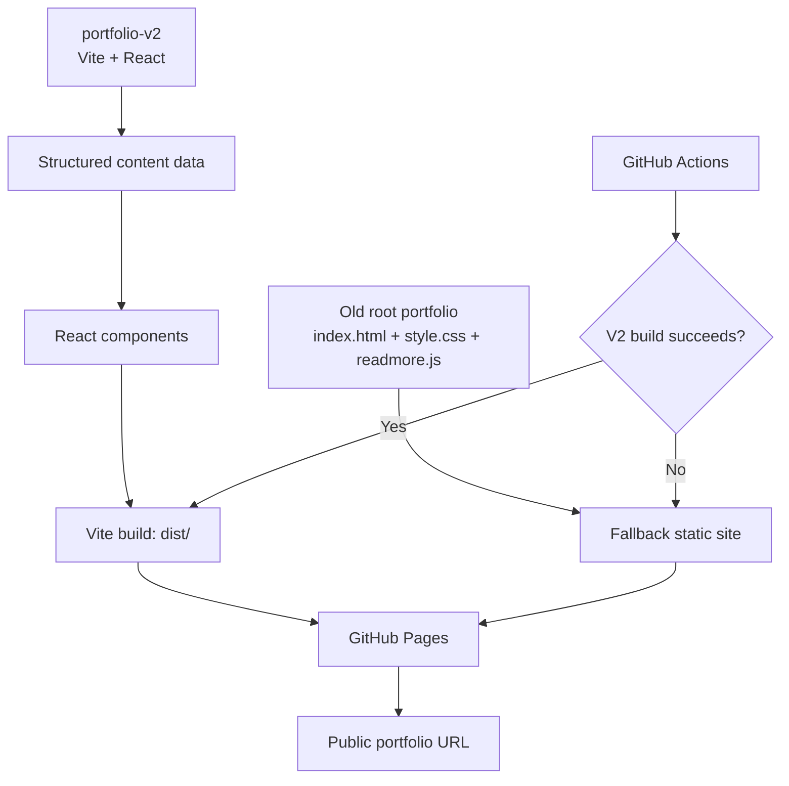

# My Portfolio

Modern portfolio for Vikram Sharma, focused on Python backend engineering, AWS serverless systems, REST APIs, production reliability, and selected project work.

Live site: [vikramsh2002.github.io/My-Portfolio](https://vikramsh2002.github.io/My-Portfolio/)

## Portfolio V2

The modern version is isolated under [`portfolio-v2`](portfolio-v2/) and built with Vite + React. The original root HTML/CSS/JS portfolio is preserved as a fallback so the site can recover automatically if the V2 build fails.


## Architecture

Detailed architecture notes: [portfolio-v2/docs/architecture.md](portfolio-v2/docs/architecture.md)



## Local Development

```powershell
cd portfolio-v2
npm install
npm run dev
npm run build
npm run preview
```
