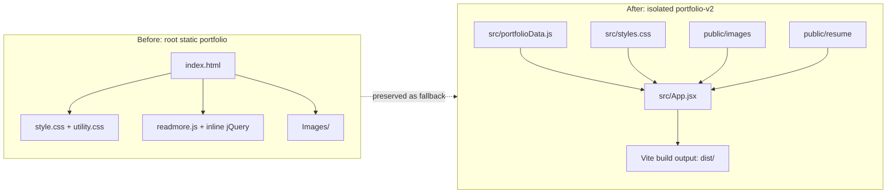
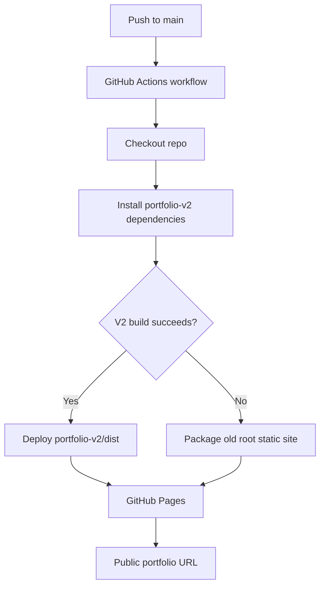

# Portfolio V2 Architecture

This document captures the architecture-level changes made during the safe V2 rebuild. The original root portfolio is intentionally preserved as a fallback while the modern Vite React version lives inside `portfolio-v2/`.

## Application Architecture

## Deployment Architecture

## Key Changes

- Preserved the old root portfolio as a working rollback/fallback path.
- Built the modern portfolio in `portfolio-v2/` so the migration is isolated and reversible.
- Moved content into structured React data in `src/portfolioData.js` instead of maintaining one large HTML file.
- Replaced inline jQuery behavior with React state and reusable components.
- Updated GitHub Pages deployment to build Vite output from `portfolio-v2/dist`.
- Added workflow fallback logic: if the V2 build fails, deploy the old root static portfolio automatically.
- Updated UI positioning toward Python backend engineering, AWS serverless systems, REST APIs, and production reliability.
